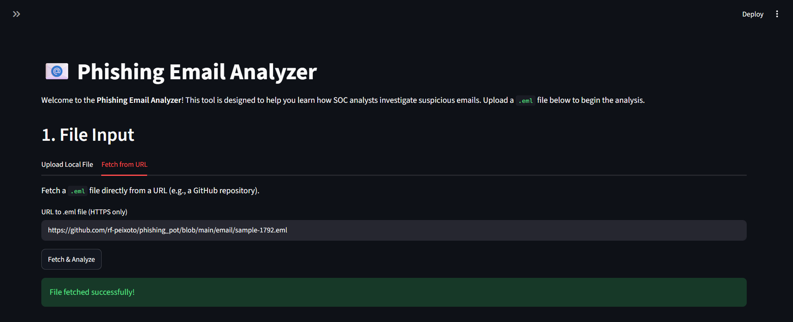
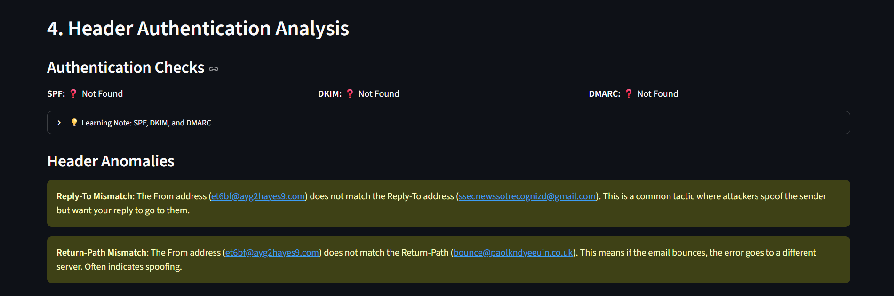

# Phishing Email Analyzer

A beginner-friendly dashboard built to help students and aspiring SOC analysts learn how to investigate suspicious `.eml` files. 

## 🌐 Live Demo
* **Read the full project breakdown:** [https://5mohamedismail.github.io](https://5mohamedismail.github.io)
* **Live App:** *(Deployment link coming soon)*

## 🧠 Why I Built This
I built this project to practice hands-on cybersecurity skills. Analyzing malicious emails manually can be overwhelming when you're just starting out in SOC (Security Operations Center) roles. I wanted to build a safe, visual tool that breaks down the steps of email analysis—like checking headers for spoofing, extracting hidden links, and looking up IP reputations. 

*Note: This is a learning project, not a production-grade enterprise tool!*

## 💡 What I Learned
While building this, I got hands-on experience with:
* Dissecting raw `.eml` files and understanding `multipart/alternative` boundaries.
* Analyzing email authentication protocols (SPF, DKIM, DMARC) to spot spoofing.
* Safely extracting Indicators of Compromise (IOCs) like IPs and URLs using regex.
* Working with external threat intelligence by integrating the VirusTotal API.

## ✨ Key Features
* **Dual Input:** Upload a local `.eml` file safely, or fetch one directly from a GitHub repository link.
* **Authentication Checking:** Automatically checks if the SPF, DKIM, and DMARC records pass or fail.
* **Safe HTML Viewing:** Safely view the raw HTML of an email to hunt for hidden links or tracking pixels without accidentally clicking them.
* **IOC Extraction:** Pulls out all unique IP addresses, email addresses, and URLs from the email body.
* **Risk Scoring:** Applies a basic scoring system to rate the email's risk (Clean to Critical) based on suspicious patterns.
* **Threat Intelligence:** Uses the VirusTotal API to look up the reputation of extracted URLs and IPs.

## 🛠️ Tech Stack
* **Python 3** (Core logic and parsing)
* **Streamlit** (Frontend dashboard UI)
* **Requests** (Fetching files and API interactions)
* **Python-Dotenv** (Environment variable management)
* **VirusTotal API** (Threat intelligence enrichment)

## 📁 Project Structure
```text
Phishing Email Analyzer/
├── analyzer/
│   ├── auth_checks.py          # Validates SPF, DKIM, DMARC
│   ├── ioc_extractor.py        # Extracts IPs, URLs, and Emails
│   ├── parser.py               # Parses raw .eml bytes into readable data
│   ├── risk_scorer.py          # Calculates the threat risk score
│   ├── threat_intelligence.py  # Caching for Threat Intel
│   ├── url_fetcher.py          # Fetches remote .eml files safely
│   └── virustotal_client.py    # VirusTotal API client
├── assets/
│   └── screenshots/            # UI screenshots for documentation
├── app.py                      # Main Streamlit application
└── requirements.txt            # Python dependencies
```

## 🚀 Installation & Setup

1. **Clone the repository:**
   ```bash
   git clone https://github.com/yourusername/phishing-email-analyzer.git
   cd phishing-email-analyzer
   ```

2. **Create a virtual environment:**
   ```bash
   python -m venv venv
   source venv/bin/activate  # On Windows: venv\Scripts\activate
   ```

3. **Install the dependencies:**
   ```bash
   pip install -r requirements.txt
   ```

## 💻 How to Run Locally

Run the Streamlit application using the following command:
```bash
python -m streamlit run app.py
```
The dashboard will open automatically in your browser at `http://localhost:8501`.

## 🛡️ Optional VirusTotal Setup

To enable the Threat Intelligence checks, you'll need a free VirusTotal API key.
1. Create a `.env` file in the root folder.
2. Add your key like this: `VIRUSTOTAL_API_KEY=your_key_here`
*(You can also paste the key directly into the app's sidebar when it's running.)*

## 📸 Screenshots

*(Add your screenshots to the `assets/screenshots/` folder to display them here)*

**Home Page & File Upload**


**Executive Summary & Risk Score**


**Email Details & Header Analysis**


**Extracted IOCs**


**VirusTotal Enrichment**


## 🔮 Future Improvements
* Parse and analyze `.zip` and `.pdf` attachments.
* Add support for more threat intelligence sources like AbuseIPDB.
* Generate exportable PDF incident reports.

## 📄 License
This project is licensed under the MIT License.
